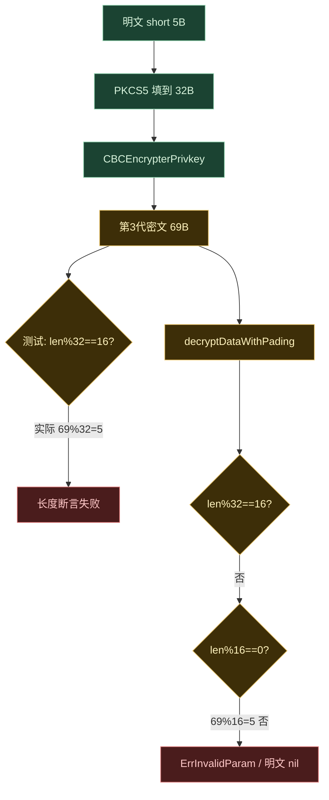

# mix 钱包 CBC/KDF 格式不匹配导致单元测试失败

- **日期**：2026-09-11
- **依赖**：`github.com/33cn/chain33 v1.71.0`
- **失败包**：`plugin/dapp/mix/wallet`
- **结论**：失败由 chain33 v1.71.0 将钱包私钥密文升级为「魔数 + PBKDF2」引起；plugin mix 仍按 v0.69.1 的长度启发式解析「当前新格式」。与账户黑名单、`chain33.toml` 无关。

## 1. 现象

CI `unit-test`（`make test` / `go test -race ./...`）中 mix wallet 相关用例失败。日志摘要：

| 用例 | 位置 | 期望 | 实际 |
|------|------|------|------|
| `TestDecryptDataWithPadingCompat` | `cryptokey_compat_test.go:48` | `len%32 == 16` | `len%32 == 5` |
| 同上 | `:50` | `err == nil` | `ErrInvalidParam` |
| 同上 | `:51` | 还原明文（如 `"short"`） | `[]byte(nil)` |
| `TestNewPrivacyWithPrivKey` | `mixbizdb_test.go` | DH 加解密往返成功 | 解密失败 |

四组明文（5 / 33 / 65 / 129 字节）全部在「新格式」分支失败；「旧格式」（ciphertext-only）断言仍通过。同包 `TestEncrypt` 走同一条 `encryptDataWithPadding` → `decryptDataWithPading` 路径，会以相同根因失败。

## 2. 根因

mix 把 chain33 **钱包专用**接口 `CBCEncrypterPrivkey` / `CBCDecrypterPrivkey` 当作通用 AES-CBC：明文先 PKCS5 填到 32 字节对齐，再用密文总长猜测格式。

chain33 v1.71.0 加密只产出第 3 代密文；mix 兼容层仍把第 2 代当成「当前新格式」。

### 2.1 密文三代

| 世代 | 大约版本 | 布局 | AES key | mix 明文（32 对齐）下的总长 |
|------|----------|------|---------|------------------------------|
| 第 1 代 | 最初 | `ciphertext` | 口令零填充，`IV=key[:16]` | `32k`，`%32==0` |
| 第 2 代 | v0.69.1 ~ v1.70 | `IV(16)+ciphertext` | 口令零填充，随机 IV | `16+32k`，`%32==16` |
| 第 3 代 | **v1.71.0 当前加密** | `C33K(4)+ver(1)+salt(16)+IV(16)+ciphertext` | PBKDF2-SHA256，21 万次 | `37+32k`，`%32==5` |

第 3 代固定头 **37 字节**。mix 测试仍断言「新格式 `len%32==16`」，与当前加密输出不一致。

### 2.2 失败因果链（明文 `"short"`，5 字节）



长度验算：

| 明文 | PKCS5 后 | 第 2 代总长 `%32` | 第 3 代总长 `%32` |
|------|----------|-------------------|-------------------|
| `short` (5B) | 32 | 48 → 16 | 69 → **5** |
| 33×`0xab` | 64 | 80 → 16 | 101 → **5** |
| 65×`0xcd` | 96 | 112 → 16 | 133 → **5** |
| 129×`0xef` | 160 | 176 → 16 | 197 → **5** |

mix 明文按 32 对齐时，第 3 代总是 `%32==5`。

### 2.3 代码对照

chain33 当前加密（只写第 3 代）：

```go
// chain33/wallet/common/crypto.go
// 新格式: MagicPrivKey(4) + version(1) + salt(16) + iv(16) + ciphertext
// 密钥由 pbkdf2 派生, 不再直接使用口令明文。
```

mix 解密仍按第 2 代分流（`plugin/dapp/mix/wallet/cryptokey.go`）：

1. `len%32==16` → 把前 16 字节当 IV，口令零填充当 AES key。
2. 否则要求 `len%16==0`，再调用 `CBCDecrypterPrivkey`。
3. 第 3 代 `69%16!=0`，在进入 chain33 解密器之前就被 `ErrInvalidParam` 拒绝。

即便去掉长度检查、把 37 字节头误当 IV 硬解，也会失败：第 3 代 AES key 是 `PBKDF2(password, salt)`，mix 第 2 代分支仍是 `copy(key, password)`。

## 3. 为什么不能把解密整段交给 chain33

`CBCDecrypterPrivkey` 内部顺序：

1. 魔数 `C33K` → PBKDF2 解密（**任意** 16 对齐密文，覆盖 mix 第 3 代）。
2. `IV+ciphertext`，但 **明文长度必须是 32 或 64**（secp256k1 / ed25519 私钥）。
3. 纯 ciphertext，`IV=key[:16]`。

mix 的 PKCS5 明文可以是 96 / 160 字节，对应第 2 代密文总长 112 / 176。chain33 第 2 代不认这些长度，会掉进第 1 代整段解密，得到乱码。

因此：

- mix **必须自己保留**第 2 代分支（`len%32==16`），以覆盖 96/160 等存量。
- mix **不能再**把「当前加密输出」识别为第 2 代。
- 第 3 代应靠魔数进入 `CBCDecrypterPrivkey`，再 PKCS5 unpad。

`hasMagic` 未导出；plugin 可用已导出的 `wcom.MagicPrivKey`、`wcom.KdfVersion` 做前缀判断。

## 4. 影响范围

### 4.1 模块

| 模块 | 调用方式 | 是否单测失败 | 是否要改代码 |
|------|----------|--------------|--------------|
| `mix/wallet/cryptokey.go` | padding + 长度启发式 | 是 | **必须改** `decryptDataWithPading` |
| `mix/wallet/cryptokey_compat_test.go` | 断言 `%32==16` | 是 | **必须改** 断言并补第 2 代用例 |
| `mixbizdb_test.go` `TestNewPrivacyWithPrivKey` / `TestEncrypt` | 同路径往返 | 是（同源） | 解密修好后应通过 |
| `privacy/wallet` | 直接 `CBC*`，明文 32B 私钥 | 否 | 否 |
| `cross2eth` / `x2ethereum` relayer | 直接 `CBC*` | 否 | 否 |
| `mix.go` 解钱包 secp256k1 | `CBCDecrypterPrivkey` | 否 | 否 |

`encryptDataWithPadding` 本身不用改逻辑：它已经调用 `CBCEncrypterPrivkey`，新写出的就是第 3 代。

### 4.2 两条业务路径共用同一函数

| 路径 | 口令 | 密文落点 | v1.71.0 之后 |
|------|------|----------|----------------|
| `savePrivacyPair` | 钱包 password | wallet.db `AccountPrivacyKey` | 新写入第 3 代；旧库仍是 1/2 代 |
| `encryptData`（DH note） | 一次性 DH secret | 链上 `DHSecret.Secret` | **新 note 也会带 `C33K` + PBKDF2**；历史 note 仍是 1/2 代 |

chain33 改动的目标是 wallet.db 抗爆破；mix 把同一实现复用到链上 note 后，**链上密文布局也会跟着变**。DH 密钥与盐每次不同，PBKDF2 缓存无效，每条 note 加解密多一次约 21 万次迭代。这是契约错位的协议/性能副作用，不是配置问题。

存量第 1、2 代数据只要解密按内容分流，仍可读。

## 5. 建议修复（本报告不实施）

最小化改动：

1. **`decryptDataWithPading`**
   - 魔数 `C33K` + version → `CBCDecrypterPrivkey`，再 PKCS5 unpad。
   - `len%32==16` → mix 自解第 2 代（覆盖 chain33 不认的 96/160）。
   - 其余 16 字节对齐 → 第 1 代，现有 `CBCDecrypterPrivkey` + unpad。
2. **`cryptokey_compat_test.go`**
   - 「当前加密格式」改为带 `C33K` 头（或 `len%32==5`）。
   - 手工构造第 2 代 `IV+ciphertext`，确认存量路径仍通。
3. **文档**：`plugin/dapp/mix/upgrade-notes.md` 第 4 节仍写「随机 IV」，建议同步为三代说明。

不改：`encryptDataWithPadding`、privacy、跨链 relayer、黑名单相关 toml。

## 6. 明确排除

以下内容与本组 mix 单测失败无关，勿混入同一修复：

- `[mver.blacklist]` / 空 `accountBlacklist`
- `ForkAccountBlacklist`
- ci_base genesis 哈希
- privacy / relayer 直接调用 `CBCEncrypterPrivkey` 的路径（明文为标准私钥长度，chain33 内部已兼容三代）

## 7. 参考代码

- chain33：`wallet/common/crypto.go`、`wallet/common/kdf.go`
- plugin：`plugin/dapp/mix/wallet/cryptokey.go`
- 测试：`plugin/dapp/mix/wallet/cryptokey_compat_test.go`、`mixbizdb_test.go`
- 既有说明：`plugin/dapp/mix/upgrade-notes.md` 第 4 节（内容已过时，仍描述第 2 代）
