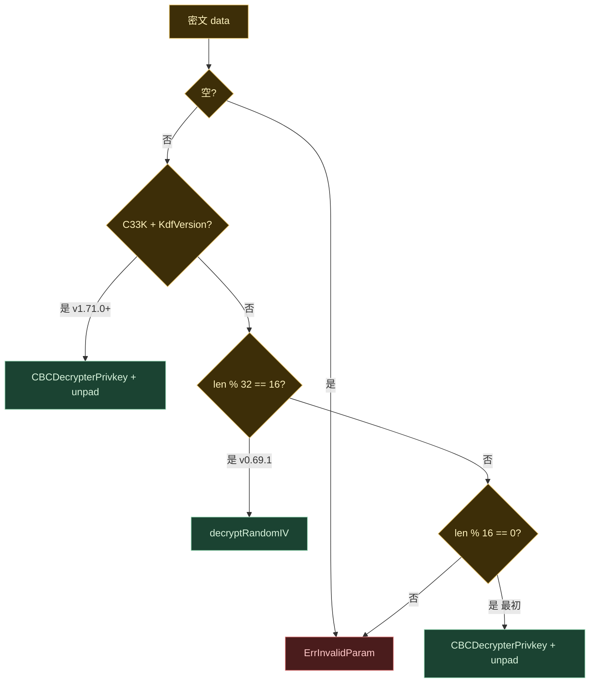

# mix `cryptokey.go` 解密适配说明

- **日期**：2026-09-14
- **范围**：`plugin/dapp/mix/wallet/cryptokey.go`（配套测试与升级说明）
- **依赖**：`github.com/33cn/chain33 v1.71.0` 及之后、且 CBC/KDF 契约不变的版本（如 1.71.1+）
- **背景**：chain33 升到 v1.71.0 后，`TestDecryptDataWithPadingCompat` / `TestNewPrivacyWithPrivKey` 失败。问题分析见 [mix-cbc-kdf-unit-test-failure.md](./mix-cbc-kdf-unit-test-failure.md)。

## 1. 改了什么

只改**解密**，不改加密。

`encryptDataWithPadding` 仍是 PKCS5 填充后调用 `CBCEncrypterPrivkey`。新密文格式由 chain33 决定，plugin 不再用长度猜测「当前输出长什么样」。

`decryptDataWithPading` 从「两路长度启发式」改为「按内容三路分流」：

| 顺序 | 判断 | 实现 | 对应密文 |
|------|------|------|----------|
| 1 | 前缀 `C33K` 且 version = `wcom.KdfVersion` | `CBCDecrypterPrivkey` + PKCS5 unpad | v1.71.0+（魔数 + PBKDF2） |
| 2 | `len%32==16` | mix 自解：前 16 字节 IV，口令零填充当 key | v0.69.1～v1.70 |
| 3 | `len%16==0` | `CBCDecrypterPrivkey` + unpad | 最初 ciphertext-only |
| — | 其他 | `ErrInvalidParam`，打长度日志 | 非法 |

为此拆出三个小函数，降低圈复杂度并补齐错误日志：

- `hasPrivKeyMagic`：用已导出的 `MagicPrivKey` / `KdfVersion`，不复制 KDF
- `decryptRandomIV`：第 2 代专用（96/160 字节明文 chain33 解不了）
- `unpadCBCPlain`：`CBCDecrypterPrivkey` 返回空时先报错，避免 `pKCS5UnPadding` panic

配套：

- `cryptokey_compat_test.go`：同一组明文覆盖三代（当前加密断言魔数且 `%32==5`；手工第 2 代；第 1 代）
- `plugin/dapp/mix/upgrade-notes.md` 第 4 节：从「随机 IV」改为三代说明

未改：`encryptData` / `decryptData` / `mix.go`、privacy、跨链 relayer、`go.mod`。

## 2. 为什么这么改

### 2.1 根因

chain33 v1.71.0 的 `CBCEncrypterPrivkey` 只写第 3 代：

`C33K(4) + version(1) + salt(16) + IV(16) + ciphertext`

AES key 改为 `PBKDF2(password, salt)`，不再用口令零填充。

mix 明文先 PKCS5 填到 32 对齐。以 `"short"`（5 字节）为例：填到 32 后总长 `37+32=69`，`69%32=5`。旧逻辑假定「当前新格式」是 `IV+ciphertext`（`%32==16`），进不了该分支；`69%16=5` 又被当成非法参数，返回 `ErrInvalidParam`。

旧逻辑同时用口令当 AES key。即便去掉长度检查硬解，第 3 代也解不开。

### 2.2 为什么不能整段交给 chain33

`CBCDecrypterPrivkey` 第 2 代只认明文 32/64 字节（钱包私钥）。mix 的 note / 隐私钥 protobuf 填完可以是 96/160。这类存量若丢给 chain33，会按第 1 代整段解密得到乱码。

`getAccountPrivacyKey` 解失败会 `savePrivacyPair` **换一套隐私密钥**，历史 note 会扫不出来。所以第 2 代必须仍由 mix 按 `len%32==16` 自解。

### 2.3 为什么先认魔数，而不是继续用长度

三代总长互不重叠：

| 世代 | 布局 | mix 明文 32 对齐后的总长 |
|------|------|--------------------------|
| 第 3 代 | 头 37 字节 + ciphertext | `37+32k`，`%32==5` |
| 第 2 代 | 头 16 字节 + ciphertext | `16+32k`，`%32==16` |
| 第 1 代 | 无头 | `32k`，`%32==0` |

第 3 代没有 16 字节对齐，旧的 `%16==0` 检查会直接拒绝。必须先认 `C33K`，才能走到 PBKDF2 解密。



### 2.4 为什么不改加密

加密已经调用 `CBCEncrypterPrivkey`。绑 v1.71.0+ 时新数据自然是第 3 代。再包一层 AES 只会分叉协议。plugin 要做的是**读懂** chain33 当前输出，并继续读旧输出。

## 3. 影响与兼容

| 场景 | 结果 |
|------|------|
| 共识 / 电路 / note hash | 不受影响。执行器不解密 `DHSecret` |
| 本机 wallet.db 旧隐私钥（第 1/2 代） | 可解，不会误走魔数分支 |
| 链上历史 note | 可解 |
| 本机新写入（第 3 代） | 可解，单测往返恢复 |
| 旧 mix 钱包解新 note | **不能**。收款端需先升级 |
| 回退到改解密之前的 plugin | wallet.db 若已写成第 3 代会解失败并换密钥，不要降级 |
| 绑定 chain33 1.71.1+ | 可以，只要 CBC/KDF 契约（魔数、导出符号、解密兼容旧代）不变 |

DH 路径的「口令」是高熵共享密钥，再套 21 万次 PBKDF2 不增加安全，只增加扫 note 的 CPU。这是沿用 `CBCEncrypterPrivkey` 的副作用，不是解密分流引入的语义错误。

## 4. 验证

```bash
go test -count=1 ./plugin/dapp/mix/wallet/ \
  -run 'TestDecryptDataWithPadingCompat|TestNewPrivacyWithPrivKey|TestEncrypt'
```

通过标准：第 3 代带 `C33K` 能还原；手工第 2 代（含 96/160）能还原；第 1 代能还原；DH 往返通过。
